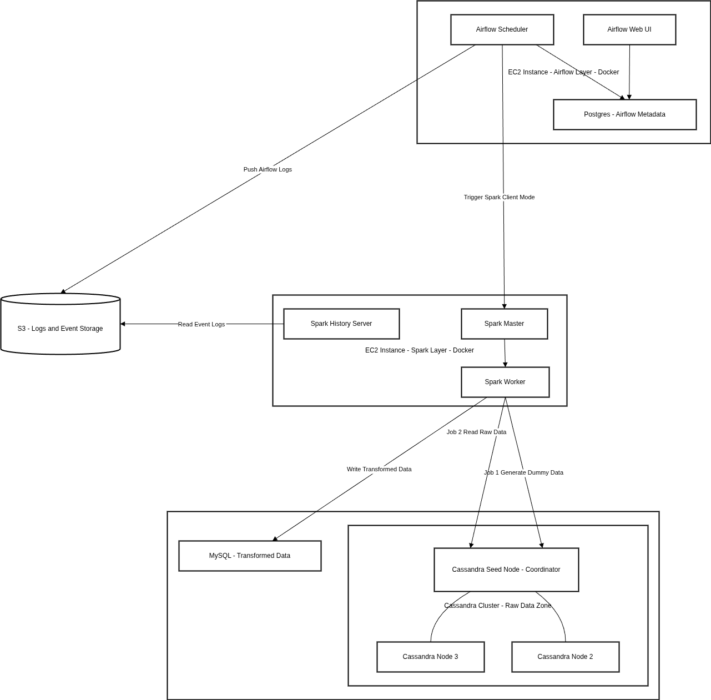

# Data Engineering: Job Board Analytics Pipeline


Hệ thống xử lý dữ liệu cho nền tảng tuyển dụng trực tuyến, mô phỏng hạ tầng của một Job Board như TopCV hay LinkedIn thu nhỏ.

**Bài toán:** Các nền tảng tuyển dụng phải xử lý hàng triệu tracking events mỗi ngày (tìm kiếm, click, apply). Dữ liệu hành vi cần được ghi nhanh, trong khi dữ liệu kinh doanh (chiến dịch, ngân sách,...) cần độ chính xác cao — hai yêu cầu khó giải quyết cùng lúc trên một hệ thống duy nhất.

**Giải pháp**:

**Cassandra** hứng toàn bộ tracking events với throughput cao

**Spark** định kỳ xử lý, làm sạch và JOIN dữ liệu hành vi với dữ liệu kinh doanh từ **MySQL**

Kết quả tổng hợp (Total Spend, Conversion Rate, v.v.) được nạp vào Data Warehouse phục vụ báo cáo tài chính và dashboard nhà tuyển dụng

> **Mục tiêu cốt lõi:** Trả lời được câu hỏi *"Chiến dịch tuyển dụng này đã tiêu bao nhiêu tiền và mang lại bao nhiêu hồ sơ?"* một cách chính xác và minh bạch.

## Outline
1. [Mục Đích Dự Án](#1-mục-đích-dự-án)
2. [Kiến Trúc Tổng Quan](#2-kiến-trúc-tổng-quan)
3. [Cấu trúc thư mục](#3-cấu-trúc-thư-mục)
4. [Schema Database](#4-schema-database)
5. [Chi tiết Luồng ETL](#5-chi-tiết-luồng-etl)
6. [Yêu Cầu Hệ Thống](#6-yêu-cầu-hệ-thống)
7. [Cài đặt và triển khai](#7-cài-đặt-và-triển-khai)
8. [Sử dụng](#8-sử-dụng)
9. [Monitoring và Logging](#9-monitoring-và-logging)
10. [Queries hữu ích](#10-queries-hữu-ích)
11. [Xử lý sự cố](#11-xử-lý-sự-cố)
12. [Tối ưu hóa](#12-tối-ưu-hóa)
13. [Tài liệu tham khảo](#13-tài-liệu-tham-khảo)
14. [Ghi chú](#14-ghi-chú)

## 1. Mục Đích Dự Án
### Mục đích
Dự án cá nhân nhằm hiểu rõ về luồng xử lý dữ liệu (data workflow) trong môi trường phân tán với:
- Xử lý dữ liệu batch sử dụng Apache Spark
- Điều phối workflow tự động với Apache Airflow
- Lưu trữ dữ liệu phân tán với Cassandra
- Quản lý dữ liệu quan hệ với MySQL
- Containerization với Docker

### Key Learning

Những kiến thức quan trọng nhất rút ra từ dự án, xếp theo mức độ hấp dẫn:

1. **Thiết kế Distributed System (bản lite)** — Hiểu tại sao cần tách biệt các lớp (ingest, process, store), đánh đổi giữa các tính chất trong CAP theorem, và lý do chọn Cassandra cho write-heavy workload thay vì RDBMS. Gọi là "bản lite" vì còn nhiều giới hạn (xem phần Ghi Chú).

2. **Data Pipeline & Data Lineage** — Xây dựng luồng ETL hoàn chỉnh từ raw events → transform → aggregate → load vào Data Warehouse. Hiểu được Data Lineage: dữ liệu đến từ đâu, đi qua bước nào, và kết quả cuối cùng có thể truy vết ngược lại.

3. **Incremental Load & Metadata** — Hiểu vai trò của metadata (bảng `watermark`) trong việc theo dõi tiến độ ETL: thay vì đọc lại toàn bộ dữ liệu mỗi lần, hệ thống chỉ xử lý phần mới kể từ lần chạy trước. Đây là một trong nhiều ứng dụng thực tế của metadata.

4. **AWS Cloud Services** — Triển khai hệ thống thực tế trên nhiều EC2 instances (database layer, Spark cluster, Airflow). Thực hành IAM: tạo custom IAM Policy, gắn IAM Role vào EC2 để cấp quyền đọc/ghi S3 mà không cần hardcode credentials. S3 được dùng để lưu trữ Spark events logs và Airflow logs tập trung.

5. **Networking Setup** — Cấu hình mạng để các services trên nhiều máy giao tiếp được với nhau: Docker networking (bridge network giữa containers), Tailscale để tạo VPN mesh kết nối EC2 instances với máy local, quản lý IP/hostname trong môi trường phân tán.

6. **Monitoring thực tế** — Theo dõi đồng thời 3 EC2 instances và 1 máy local: CPU, RAM, disk, network. Nhận ra sự phức tạp khi không có công cụ tập trung — đây là lý do cần Prometheus/Grafana trong production.

7. **Logging & Debugging** — Nhận ra tầm quan trọng của logging trong hệ thống phân tán: khi job fail, log là thứ duy nhất giúp xác định vấn đề. Thực hành đọc Spark logs, Airflow task logs và container logs để debug.

8. **Engineering Practices** — Tổ chức cấu trúc thư mục rõ ràng theo từng layer (config, data_io, process), viết commit message có nghĩa, và quản lý biến môi trường qua `.env`.


## 2. Kiến Trúc Tổng Quan

### Các Thành Phần Chính

> **Lưu ý về ports:** Spark UI (8080) và Airflow UI (8080) đều dùng cùng port nhưng chạy trên **các EC2 instances riêng biệt**, không conflict với nhau.

| Service | Port | EC2 Instance | Ghi chú |
|---|---|---|---|
| **MySQL** | 3306 | Database EC2 | Dimension tables + kết quả ETL |
| **Cassandra** (3 nodes) | 9042 | Database EC2 | Raw tracking events |
| **Spark Master UI** | 8080 | Spark EC2 | Web UI giám sát jobs |
| **Spark Worker UI** | 8081 | Spark EC2 | Web UI worker |
| **Spark History Server** | 18080 | Spark EC2 | Xem lịch sử jobs |
| **Spark RPC** | 7077 | Spark EC2 | Giao tiếp nội bộ cluster |
| **Airflow Web UI** | 8080 | Airflow EC2 | DAG management |

**MySQL** — Lưu trữ dữ liệu chiều: jobs, campaigns, companies, publishers. Lưu kết quả tổng hợp (bảng `events`) và metadata watermark để theo dõi tiến độ ETL.

**Cassandra Cluster** — 3 nodes: `cassandra-seed`, `cassandra-node-2`, `cassandra-node-3`. Lưu trữ raw tracking events với khả năng mở rộng cao. Bảng `tracking` với partition key là `event_date` và clustering key là `create_time`.

**Apache Spark** — 3 services: master, worker, history-server. Engine xử lý ETL batch. Đọc incremental data từ Cassandra, transform và ghi vào MySQL.

**Apache Airflow** — Điều phối và lập lịch các ETL jobs. 2 DAGs chính:
  - `gen-dummy-data`: Tạo dữ liệu test
  - `ETL-jobs`: Chạy pipeline ETL chính

### Luồng Dữ Liệu

```
[Tracking Events] → [Cassandra] → [Spark ETL] → [MySQL Events Table]
                                        ↓
                                   [Join with]
                                        ↓
                              [MySQL Dimension Tables]
                                        ↓
                              [Watermark Updated]
```

## 3. Cấu Trúc Thư Mục

```
dataengineering/
├── code/
│   ├── extended/                 # Module ETL chính
│   │   ├── config/              # Cấu hình Spark và kết nối
│   │   │   ├── settings.py      # Biến môi trường và constants
│   │   │   └── spark.py         # Factory để tạo SparkSession
│   │   ├── data_io/             # Đọc/ghi dữ liệu
│   │   │   ├── readers.py       # Đọc từ Cassandra và MySQL
│   │   │   ├── writers.py       # Ghi vào MySQL
│   │   │   └── metadata.py      # Quản lý watermark
│   │   ├── process/             # Xử lý và chuyển đổi dữ liệu
│   │   │   ├── transformations.py  # Logic transform chính
│   │   │   └── validations.py   # Validation và data quality
│   │   └── main.py              # Entry point của ETL job
│   └── test/
│       └── dummy-gennerator.py  # Tạo dữ liệu test
├── dags/
│   ├── etl.py                   # DAG ETL chính
│   └── gen-data.py              # DAG tạo dữ liệu test
├── docker/
│   ├── spark/                   # Docker configs cho Spark
│   │   ├── Dockerfile
│   │   ├── docker-compose.yaml
│   │   └── spark-defaults.conf
│   ├── airflow/                 # Docker configs cho Airflow
│   │   ├── Dockerfile
│   │   └── docker-compose.yaml
│   └── database/                # Docker configs cho MySQL & Cassandra
│       └── docker-compose.yaml
├── queries/
│   ├── mysql/
│   │   ├── DDL/                 # Schema definitions
│   │   ├── createdUserMySQL.sql
│   │   └── addcolumnMySQL.sql
│   └── cassandra/
│       └── SchemaDefinedCassandra.sql
├── data/                        # Dữ liệu CSV mẫu để seed ban đầu
│   ├── mysql/
│   │   ├── events.csv
│   │   └── master_publisher.csv
│   └── cassandra/
│       └── tracking_with_event_date.csv
├── .env.example                 # Template biến môi trường
├── requirements.txt             # Python dependencies
└── README.md
```

## 4. Schema Database

### Cassandra — Bảng `recruitment.tracking`

Lưu trữ raw tracking events từ nền tảng tuyển dụng.

```sql
CREATE TABLE recruitment.tracking (
    event_date    date,        -- Partition key: ngày xảy ra event
    create_time   timeuuid,    -- Clustering key: timestamp chính xác (UUID v1)

    -- Thông tin quảng cáo
    bid           float,       -- Giá bid của publisher
    campaign_id   int,
    group_id      int,
    job_id        int,
    publisher_id  int,
    custom_track  text,        -- Loại event: click | conversion | qualified | unqualified

    -- Metadata tracking (browser, UTM, v.v.)
    ts            text,        -- Timestamp dạng string từ client
    ua            text,        -- User agent
    utm_campaign  text,
    utm_source    text,
    utm_medium    text,
    -- ... các cột tracking khác

    PRIMARY KEY ((event_date), create_time)
) WITH CLUSTERING ORDER BY (create_time ASC);
```

> **Thiết kế partition key:** `event_date` giúp phân tán dữ liệu theo ngày, tránh hot partition. Spark ETL đọc incremental theo `create_time` trong từng partition ngày.

### MySQL — Bảng `events` (kết quả ETL)

Kết quả đã aggregate, phục vụ báo cáo và dashboard.

| Cột | Kiểu | Mô tả |
|---|---|---|
| `dates` | DATE | Ngày |
| `hours` | INT | Giờ trong ngày |
| `job_id` | INT | ID công việc |
| `publisher_id` | INT | ID publisher |
| `campaign_id` | INT | ID chiến dịch |
| `group_id` | INT | ID nhóm quảng cáo |
| `company_id` | INT | ID công ty (join từ bảng `job`) |
| `clicks` | INT | Tổng số clicks |
| `bid_set` | FLOAT | Giá bid trung bình |
| `spend_hour` | FLOAT | Tổng chi phí (bid × clicks) |
| `conversion` | INT | Số conversions |
| `qualified_application` | INT | Hồ sơ đạt yêu cầu |
| `disqualified_application` | INT | Hồ sơ không đạt |
| `sources` | TEXT | Nguồn dữ liệu |
| `processed_at` | DATETIME | Thời điểm ETL xử lý |

### MySQL — Bảng `events_metadata` (watermark)

Theo dõi tiến độ ETL để hỗ trợ incremental load.

| Cột | Kiểu | Mô tả |
|---|---|---|
| `id` | INT AUTO_INCREMENT | PK |
| `pipeline_name` | VARCHAR(100) | Tên pipeline |
| `max_event_time` | DATETIME(3) | Mốc thời gian cao nhất đã xử lý |
| `min_event_time` | DATETIME(3) | Mốc thời gian thấp nhất của batch |
| `row_count` | INT | Số records đã xử lý |
| `status` | VARCHAR(20) | `SUCCESS` / `FAILED` |
| `created_at` | TIMESTAMP | Thời điểm ghi metadata |

## 5. Chi Tiết Luồng ETL

### 1. Đọc Dữ Liệu (Extract)

**Từ Cassandra:**
- Đọc incremental từ bảng `tracking` dựa trên watermark timestamp
- Filter theo điều kiện `ts > start_watermark`
- Columns quan trọng: `event_date`, `create_time`, `job_id`, `custom_track`, `bid`, `campaign_id`, `group_id`, `publisher_id`

**Từ MySQL:**
- Đọc dimension data từ bảng `job`
- Lấy thông tin: `job_id`, `company_id`, `campaign_id`, `group_id`

### 2. Xử Lý Dữ Liệu (Transform)

**Normalize Event Time:**
- Chuyển đổi TimeUUID (`create_time`) sang timestamp chuẩn
- Sử dụng UDF custom để parse UUID version 1

**Data Quality Checks:**
- Validate timestamp không null
- Filter `custom_track` theo các giá trị hợp lệ: `click`, `conversion`, `qualified`, `unqualified`
- Loại bỏ records không hợp lệ

**Aggregation:**
- Group by: `dates`, `hours`, `job_id`, `publisher_id`, `campaign_id`, `group_id`
- Metrics tính toán:
  - `clicks`: Tổng số clicks
  - `bid_set`: Giá bid trung bình
  - `spend_hour`: Tổng chi phí (bid × số clicks)
  - `conversion`: Số lượng conversions
  - `qualified_application`: Ứng dụng đạt yêu cầu
  - `disqualified_application`: Ứng dụng không đạt yêu cầu

**Enrichment:**
- JOIN với job dimension để lấy thêm `company_id`
- Thêm metadata: `processed_at`, `sources`

### 3. Ghi Dữ Liệu (Load)

- Ghi kết quả vào bảng `events` trong MySQL
- Mode: `append`
- Batch size: 10,000 records
- Isolation level: `READ_COMMITTED`
- Cập nhật watermark metadata sau khi ghi thành công

## 6. Yêu Cầu Hệ Thống

Hệ thống được triển khai phân tán trên nhiều máy (EC2 instances + máy local), không chạy hoàn toàn trên một máy duy nhất.

| Thành phần | Môi trường | Ghi chú |
|---|---|---|
| MySQL + Cassandra | EC2 instance | Database layer |
| Spark cluster | EC2 instance | Master + Workers |
| Apache Airflow | EC2 instance | Scheduler + Webserver |
| Máy local | Laptop | Development, submit jobs |

> Xem hướng dẫn setup EC2 chi tiết [tại đây](docs/aws/ec2/README.md)

### Phần mềm cần cài đặt (trên server/EC2)

| Phần mềm | Version | Ghi chú |
|---|---|---|
| **Docker Engine** | 20.10+ | Hỗ trợ Compose V2 |
| **Docker Compose** (plugin) | V2+ | Dùng `docker compose` (không có dấu `-`) |
| **Docker Buildx** | 0.17.1+ | Cần để build multi-platform images |
| **Tailscale** | Latest | VPN mesh kết nối các EC2 với máy local |
| **Python** | 3.8 | Dùng trong Airflow container |
| **AWS CLI** | v2 | Nếu cần thao tác S3 từ máy local |

### Versions các thành phần chính

| Thành phần | Version | Lý do cố định |
|---|---|---|
| **Apache Spark** | `3.5.1` | ⚠️ **Bắt buộc** — phải khớp với Spark-Cassandra Connector |
| **Apache Airflow** | `2.8.1` | Base image `apache/airflow:2.8.1-python3.8` |
| **Cassandra** | `5.0.6` | Image `cassandra:5.0.6-jammy` |
| **MySQL** | LTS | Image `mysql:lts` |
| **Java** | OpenJDK 11 | Cài trong Airflow Dockerfile |
| **Scala** | 2.12 | Trong Spark base image |
| **PySpark** | `3.5.1` | Phải khớp với Spark version |

### JAR Dependencies (tự động tải khi build Docker)

| JAR | Version |
|---|---|
| `spark-cassandra-connector-assembly_2.12` | `3.5.1` |
| `mysql-connector-j` | `8.4.0` |
| `hadoop-aws` | `3.3.4` |
| `aws-java-sdk-bundle` | `1.12.262` |

> **Tại sao Spark 3.5.1 là bắt buộc?** `spark-cassandra-connector-assembly_2.12-3.5.1.jar` được build cho đúng Spark 3.5.1 + Scala 2.12. Dùng version Spark khác sẽ gây lỗi `ClassNotFoundException` hoặc binary incompatibility khi runtime.

## 7. Cài Đặt và Triển Khai

### Biến Môi Trường

Tạo file `.env` từ `.env.example`:

```bash
cp .env.example .env
```

```bash
# Database Configuration
DATABASE_IP=database-host
MYSQL_USER=your_user
MYSQL_PASSWORD=your_password
MYSQL_DATABASE=data_engineering
MYSQL_ROOT_PASSWORD=root_password

# Cassandra Configuration
CASSANDRA_KEYSPACE=recruitment
CASSANDRA_CLUSTER_NAME=your_cluster
CASSANDRA_DC=datacenter1
CASSANDRA_RACK=rack1

# Airflow Configuration
AIRFLOW_UID=1000
AIRFLOW_IP=airflow-scheduler

# Timezone
TZ=Asia/Ho_Chi_Minh
```

### Khởi Động Hệ Thống

**Bước 1: Khởi động Database Layer**

```bash
cd docker/database
docker compose up -d
```

Chờ Cassandra cluster khởi động hoàn tất (khoảng 2-3 phút). Kiểm tra trạng thái:

```bash
docker exec -it cassandra-seed nodetool status
```

Tất cả nodes phải ở trạng thái `UN` (Up/Normal) trước khi tiếp tục.

**Bước 2: Tạo Schema**

MySQL:
```bash
docker exec -i mysql mysql -uroot -p$MYSQL_ROOT_PASSWORD < queries/mysql/createdUserMySQL.sql
```

Cassandra:
```bash
docker exec -i cassandra-seed cqlsh < queries/cassandra/SchemaDefinedCassandra.sql
```

**Bước 3: Nạp Dữ Liệu Mẫu (Seed Data)**

Nạp dữ liệu dimension vào MySQL (jobs, campaigns, publishers):
```bash
# Nạp master_publisher
docker exec -i mysql mysql -uroot -p$MYSQL_ROOT_PASSWORD data_engineering \
  -e "LOAD DATA LOCAL INFILE '/dev/stdin' INTO TABLE master_publisher FIELDS TERMINATED BY ',' IGNORE 1 ROWS;" \
  < data/mysql/master_publisher.csv
```

Nạp dữ liệu tracking mẫu vào Cassandra (để test ETL):
```bash
docker exec -i cassandra-seed cqlsh -e "COPY recruitment.tracking FROM STDIN WITH HEADER=TRUE;" \
  < data/cassandra/tracking_with_event_date.csv
```

> Hoặc dùng DAG `gen-dummy-data` trong Airflow để tự động sinh dữ liệu test (xem mục [Sử dụng](#8-sử-dụng)).

**Bước 4: Khởi động Spark Cluster**

```bash
cd docker/spark
docker build -t spark-extended:3.5.1 .
docker compose up -d
```

Kiểm tra Spark UI: `http://<spark-ec2-ip>:8080`

**Bước 5: Khởi động Airflow**

```bash
cd docker/airflow
docker build -t custom-airflow:2.8.1-python3.8 .
docker compose up -d
```

Truy cập Airflow UI: `http://<airflow-ec2-ip>:8080` (username/password: `airflow`/`airflow`)

### Cài Đặt Python Dependencies (Local Development)

```bash
python -m venv .venv
source .venv/bin/activate  # Linux/Mac
# hoặc .venv\Scripts\activate  # Windows
pip install -r requirements.txt
```

## 8. Sử Dụng

### Chạy ETL Pipeline qua Airflow

1. Truy cập Airflow Web UI: `http://<airflow-ec2-ip>:8080`
2. Bật DAG `ETL-jobs`
3. Trigger DAG manually hoặc đợi schedule (`@hourly`)
4. Theo dõi logs và task execution

**Kết quả mong đợi sau khi ETL chạy thành công:**
- Bảng `events` trong MySQL có thêm records mới với `processed_at` được set
- Bảng `events_metadata` có thêm 1 row với `status = 'SUCCESS'` và `max_event_time` được cập nhật
- Lần chạy tiếp theo sẽ chỉ xử lý events có `create_time > max_event_time` (incremental)

### Tạo Dữ Liệu Test

Trigger DAG `gen-dummy-data` trong Airflow hoặc chạy trực tiếp:

```bash
spark-submit \
  --master local[*] \
  --conf spark.cassandra.connection.host=localhost \
  code/test/dummy-gennerator.py
```

### Chạy ETL Local (Development)

```bash
export DATABASE_IP=localhost
export MYSQL_USER=spark
export MYSQL_PASSWORD=spark
export MYSQL_DATABASE=data_engineering
export CASSANDRA_KEYSPACE=recruitment

spark-submit \
  --master local[*] \
  --packages com.datastax.spark:spark-cassandra-connector_2.12:3.5.0,mysql:mysql-connector-java:8.0.33 \
  code/extended/main.py
```

## 9. Monitoring và Logging

### Spark

- Spark Master UI: `http://<spark-ec2-ip>:8080`
- Spark Worker UI: `http://<spark-ec2-ip>:8081`
- Spark History Server: `http://<spark-ec2-ip>:18080`
- Logs được lưu vào S3: `s3://spark-log-proj/spark-events/`

### Airflow

- Web UI: `http://<airflow-ec2-ip>:8080`
- Logs: `docker/airflow/logs/`
- Remote logs trên S3: `s3://spark-log-proj/airflow-logs/`

### Database

MySQL logs:
```bash
docker logs mysql
```

Cassandra logs:
```bash
docker logs cassandra-seed
docker logs cassandra-node-2
docker logs cassandra-node-3
```

## 10. Queries Hữu Ích

### Kiểm tra dữ liệu MySQL

```sql
-- Xem events đã aggregate
SELECT * FROM events ORDER BY dates DESC, hours DESC LIMIT 10;

-- Xem watermark (tiến độ ETL)
SELECT * FROM events_metadata ORDER BY created_at DESC LIMIT 5;

-- Thống kê theo campaign
SELECT campaign_id, SUM(clicks) as total_clicks, SUM(spend_hour) as total_spend
FROM events
GROUP BY campaign_id
ORDER BY total_spend DESC;

-- Conversion rate theo job
SELECT job_id,
       SUM(clicks) as total_clicks,
       SUM(conversion) as total_conversions,
       ROUND(SUM(conversion) / NULLIF(SUM(clicks), 0) * 100, 2) as conversion_rate_pct
FROM events
GROUP BY job_id
ORDER BY conversion_rate_pct DESC;
```

### Kiểm tra dữ liệu Cassandra

```cql
-- Đếm số records
SELECT COUNT(*) FROM recruitment.tracking;

-- Xem dữ liệu gần nhất
SELECT * FROM recruitment.tracking
WHERE event_date = '2026-01-29'
LIMIT 10;

-- Thống kê theo custom_track
SELECT custom_track, COUNT(*)
FROM recruitment.tracking
WHERE event_date = '2026-01-29'
GROUP BY custom_track;
```

## 11. Xử Lý Sự Cố

### Cassandra không khởi động

```bash
# Kiểm tra logs
docker logs cassandra-seed

# Restart cluster
cd docker/database
docker compose restart cassandra-seed cassandra-node-2 cassandra-node-3
```

> Node 2 và Node 3 phụ thuộc vào seed node — chờ seed node `healthy` trước khi các node khác start (được cấu hình `depends_on` với `condition: service_healthy`).

### Spark job fail

```bash
# Xem logs trong Airflow UI hoặc
docker logs airflow-scheduler

# Kiểm tra Spark worker
docker logs spark-worker
```

### Connection timeout

Đảm bảo các services đã khởi động đầy đủ:
```bash
docker ps -a
```

Kiểm tra Tailscale kết nối giữa các EC2:
```bash
tailscale status
```

### Lỗi JAR incompatibility

Nếu gặp `ClassNotFoundException` hoặc lỗi liên quan đến Cassandra connector:
- Đảm bảo Spark version là **3.5.1** (không phải 3.4.x hay 3.3.x)
- Rebuild Docker image: `docker build --no-cache -t spark-extended:3.5.1 .`

## 12. Tối Ưu Hóa

### Tăng Performance

1. Điều chỉnh Spark configs trong `spark-defaults.conf`:
   - Tăng `spark.executor.memory`
   - Tăng `spark.driver.memory`
   - Điều chỉnh `spark.sql.shuffle.partitions`

2. Cassandra tuning:
   - Tăng `MAX_HEAP_SIZE` (hiện tại: 1024M/node)
   - Điều chỉnh `CASSANDRA_NUM_TOKENS` (hiện tại: 16)

3. MySQL optimization:
   - Index trên `dates`, `hours`, `job_id`
   - Tăng `innodb_buffer_pool_size` (hiện tại: 512M)

### Scaling

- Thêm Spark workers: Sửa `docker-compose.yaml` trong `docker/spark`
- Scale Cassandra: Thêm nodes trong `docker/database/docker-compose.yaml`
- Tăng Airflow parallelism: Sửa `AIRFLOW__CORE__PARALLELISM`

## 13. Tài Liệu Tham Khảo

- Apache Spark: https://spark.apache.org/docs/latest/
- Apache Airflow: https://airflow.apache.org/docs/
- Apache Cassandra: https://cassandra.apache.org/doc/latest/
- MySQL: https://dev.mysql.com/doc/
- Spark-Cassandra Connector: https://github.com/datastax/spark-cassandra-connector
- JDBC: https://mvnrepository.com/
- [Dựng Apache Airflow phiên bản cực nhẹ LocalExecutor với Docker Compose](https://viblo.asia/p/dung-apache-airflow-phien-ban-cuc-nhe-localexecutor-voi-docker-compose-x7Z4DAjPJnX)


## 14. Ghi Chú

> **Đây là dự án học tập.** Một số điểm cần lưu ý trước khi đưa vào production:

**Giới hạn kỹ thuật:**
- PySpark không hỗ trợ [cluster mode trên standalone cluster](https://spark.apache.org/docs/latest/submitting-applications.html) — chỉ chạy được `client` hoặc `local` mode.
- Cassandra hiện chỉ cấu hình single datacenter, chưa có replication cross-region — chưa tận dụng được tính **P (Partition Tolerance)** trong CAP theorem.
- Chưa có backup hay disaster recovery plan.

**Bảo mật:**
- Credentials được lưu trực tiếp trong `.env` — nên dùng secret manager (AWS Secrets Manager, Vault, v.v.) khi deploy thật.
- Spark UI và Airflow UI chưa có authentication/authorization.

**Monitoring:**
- Hiện tại chỉ dùng Spark History Server và Airflow logs cơ bản.
- Nên tích hợp thêm **Prometheus + Grafana** để theo dõi metrics hệ thống, hoặc **ELK Stack** để tập trung logs.

**Hướng phát triển tiếp theo:**
- Project hiện dùng Docker Compose — toàn bộ Spark Master và Workers chạy trên cùng một máy, chưa có khả năng chịu lỗi thực sự.
- Nên triển khai theo mô hình **Master-Worker phân tán**: 1 Spark Master điều phối, các Spark Workers nằm trên các instance riêng biệt (ví dụ: EC2 nodes) — đúng với kiến trúc **Master-Worker pattern** mà Spark được thiết kế để tận dụng.
- Khi scale lên production, nên chuyển sang **Kubernetes (K8s)** để tự động hóa việc scaling, restart khi lỗi, và quản lý tài nguyên hiệu quả hơn.
