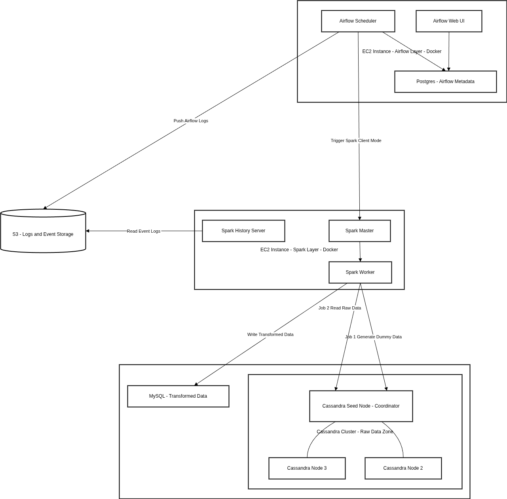

**architecture**

credit to: 
1. [spark logging and monitoring](https://spark.apache.org/docs/latest/monitoring.html)
2. [Dựng Apache Airflow phiên bản cực nhẹ LocalExecutor với Docker Compose](https://viblo.asia/p/dung-apache-airflow-phien-ban-cuc-nhe-localexecutor-voi-docker-compose-x7Z4DAjPJnX)
